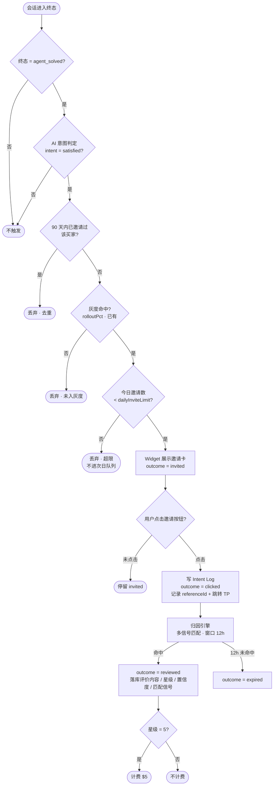

# PRD — Review Agent 归因系统

**版本：** v1.6
**日期：** 2026-07-15
**状态：** 待研发评审

> **交付范围说明**：v2 的开发交付物是 **merchant-dashboard 页面改造**（§六 + §五 API）。触发资格、发送控制、归因匹配（§二、§三、§四）的后端逻辑**已按最新规则上线运行**，本文档保留其口径供前端展示对齐，非本版待开发项。面向研发评审的页面重点版见 `review-agent-v2-prd.html`。

---

## 一、背景与本版范围

Review Agent 已在 merchant-dashboard 上线最小版本（`/review-agent`：开关、每日上限、TP 主页 URL、三张累计 KPI 卡、Sessions 列表）。归因引擎与触发/发送逻辑后端已按 §二~§四 规则上线。

本版补齐/改造的内容（**开发主体 = 商家后台**）：

| 模块 | 内容 |
|------|------|
| 触发资格 | AI 意图判定（satisfied）+ 问题已解决，双条件 AND |
| 发送控制 | 90 天去重；超限直接丢弃（取消 v1.1 的次日队列） |
| Outcome 状态机 | invited → clicked → reviewed / expired，四态透出到商家后台 |
| 评价回显 | 归因到的 Trustpilot 评价内容 + 星级 + 置信度展示 |
| 商家后台 | 漏斗 KPI + 时间范围；Sessions 筛选 + 搜索；Unlimited 语义修复 |
| 邀请文案 | 可自定义，系统提供默认文案（config 增加 `inviteMessage`） |
| 低星跟进 | Needs follow-up 标记 + Reply on Trustpilot + Mark as handled + Notifications 提醒 |

**不在本版范围**：灰度控制（已有）、归因引擎内部规则（已有）、今日用量指示（明确不做）、次日队列（明确不做）、roadmap 项（漏斗诊断建议、邀请时机 A/B、referenceId 精确归因、归因申诉等）。

---

## 二、核心流程

### 2.1 整体流程图（v1.2）



### 2.2 触发资格判定

同时满足以下两条才进入发送控制链路：

| 条件 | 判定方式 |
|------|----------|
| **问题已解决** | 会话终态 = `agent_solved`（AI 标记 resolved 的既有信号），`customer_closed` / `timeout` / `abandoned` 均不触发 |
| **用户明确表示满意** | **AI 意图判定**：会话进入终态时，由 LLM 对全对话做意图分类，输出 `satisfied` / `neutral` / `dissatisfied`，仅 `satisfied` 通过。复用 support-agent 已有会话意图体系，用户无感知，无 CSAT 弹窗 |

> 合规注记：满意度前置筛选与 seel-prd-v2（v2.0）的合规立场（FTC / Trustpilot ToS 移除选择性邀请）相反。本决策已由业务侧拍板（2026-07-14），v2.0 文档合规章节同步标注废弃。风险点：Trustpilot 对 review gating 有封号先例，需运营侧知悉。

### 2.3 发送控制（按顺序执行，任一不过即丢弃）

| 顺序 | 规则 | 说明 |
|------|------|------|
| 1 | **90 天去重** | 买家标识：`email` 小写归一优先，缺失时回退 `customerId`。以**实际发出邀请**（进入 invited 态）为准计一次，滚动 90 天窗口内不再发 |
| 2 | **灰度**（已有） | rolloutPct 命中判断，逻辑不变 |
| 3 | **每日上限** | 今日（UTC 自然日）invited 数 ≥ `dailyInviteLimit` 时**直接丢弃**，不排队、不顺延。`dailyInviteLimit = 0` 语义为 Unlimited |

被丢弃的会话**不写入 Sessions 表**（表只记录实际发出过邀请的会话），丢弃原因仅记后端日志（留存 180 天，口径不变）。

### 2.4 归因匹配规则（2026-07 实测校准）

依据 GravaStar 全量归因分析（25 条评价，10 条成功归因）校准：

| 项 | 规则 |
|----|------|
| **归因窗口** | 点击后 **12 小时**（与实测分析口径一致：10 条归因评价中 9 条在 3.5h 内提交，最快 6 分钟，最长 10.8h）。取代 v1.1 的 T+2~T+6 天口径 |
| **窗口锚点** | **邀请点击时间**（Intent Log 写入时刻）。⚠️ **研发评审确认项**：点击埋点的存在性与可靠性需后端确认——若缺失，锚点回退为**邀评发出时间**（同 12h 窗口），漏斗 Invite Clicks 层同步移除（降为 Shown → Reviews → 5-Star 三层），pending 注记锚点同步改为"最近 12h 发出" |
| **匹配基础** | `conversation_id`（邀评记录）与工单直接关联，在此基础上叠加信号 |
| **匹配信号** | ① 时间接近度（点击 → 评价间隔）② 客户名吻合 ③ **评价内容与会话摘要语义匹配**（如 "walked me through step by step" ↔ "跟随排查步骤解决"） |
| **置信度分层** | **High**：客户名吻合或间隔 ≤ 20min，且内容对应；**Medium**：窗口内 + 内容对应。低于 Medium 不归因 |
| **排除项** | 纯产品评价（无客服互动描述）不归因；描述邮件客服的评价不归因（非 live chat 渠道） |

---

## 三、Outcome 状态机

```
invited ──用户点击──▶ clicked ──归因命中──▶ reviewed（终态）
   │                     │
   └──（不流转，停留）      └──超归因窗口──▶ expired（终态）
```

| 状态 | 定义 | 时间戳字段 |
|------|------|------------|
| `invited` | 邀请卡已在 Widget 展示，用户未点击 | `invitedAt`（即 Session 记录的 `createdAt`） |
| `clicked` | 用户点击邀请按钮、写入 Intent Log、跳转 TP | `clickedAt`（= Intent Log 写入时间，**后端已有，无需新埋点**） |
| `reviewed` | 归因引擎命中，评价内容/星级/置信度已落库 | `reviewedAt` |
| `expired` | clicked 后超归因窗口（**12h**）仍未命中，Intent Log 自动关闭 | — |

说明：
- `invited` 停留态不设超时流转——未点击的邀请永远停在 invited，不转 expired（expired 仅描述"点了但没归因到"）。
- 漏斗四层 = 状态机四态的直接聚合：Invites Sent（invited+）→ Clicked（clicked+）→ Reviews（reviewed）→ 5-Star（reviewed 且 rating=5）。

---

## 四、归因结果数据（新增回显字段）

归因命中时，除已有字段（reviewId / sessionId / attributedAt）外，需**落库并透出**（置信度口径按 §2.4：`confidenceTier` high/medium + `matchSignals` 信号说明）：

| 字段 | 类型 | 说明 |
|------|------|------|
| `reviewText` | string | Trustpilot 评价正文（全文落库，前端截断展示） |
| `rating` | number | 评价星级 1–5 |
| `reviewUrl` | string | 该条评价在 Trustpilot 的直达链接 |

---

## 五、API 契约变更（merchant-dashboard ⇄ 后端）

### 5.1 `GET /md/open/aisupport/review-agent/summary`

新增查询参数：`dateFrom` / `dateTo`（ISO 日期，缺省 = 近 30 天）。**统计按 cohort 口径**：时间范围筛选 invitedAt，四层指标均为该批邀请的下游事件计数。

```json
{
  "enabled": true,
  "dailyInviteLimit": 50,
  "tpPageUrl": "https://www.trustpilot.com/review/example.com",
  "tpPageStatus": "verified",
  "lastCrawledAt": "2026-07-14T06:00:00Z",
  "invitesShown": 630,
  "invitesClicked": 187,
  "reviews": 23,
  "fiveStarReviews": 18,
  "pendingAttribution": 12
}
```

新增字段说明：`tpPageStatus`（`verified` / `unreachable` / `not_configured`，状态点依据）、`lastCrawledAt`（状态点副文案）、`invitesShown`（改名，原 invitesSent）、`pendingAttribution`（仍在归因窗口内的邀请数，未成熟标注用）。

### 5.2 `GET /md/open/aisupport/review-agent/sessions`

新增查询参数：

| 参数 | 类型 | 说明 |
|------|------|------|
| `search` | string | 模糊匹配 customerName / orderId / conversationId |
| `outcome` | enum | `invited` / `clicked` / `reviewed` / `expired`，可多选（逗号分隔） |
| `rating` | number | 按星级筛选（仅对 reviewed 生效） |
| `dateFrom` / `dateTo` | date | 按 invitedAt 过滤 |

list 元素新增字段：

```json
{
  "sessionId": "s-001",
  "conversationId": "conv-10342",
  "conversationUrl": "/support-agent?tab=performance&subTab=conversations&search=conv-10342&detail=true",
  "customerName": "Carlos Rivera",
  "orderId": "10342",
  "createdAt": "2026-07-07T01:20:00Z",
  "clickedAt": "2026-07-07T01:24:00Z",
  "reviewedAt": "2026-07-10T09:12:00Z",
  "outcome": "reviewed",
  "rating": 5,
  "reviewText": "Amazing support, solved my issue in minutes...",
  "reviewUrl": "https://www.trustpilot.com/reviews/xxxx",
  "confidenceTier": "medium",
  "matchSignals": "Timing (79 min) + content",
  "followUpStatus": "needed"
}
```

`followUpStatus`：`needed`（reviewed 且 rating ≤ 4，未处理）/ `handled` / `null`（5 星或非 reviewed）。

### 5.3 `PATCH /md/open/aisupport/review-agent/config`

由全量 POST 改为**字段级 PATCH**：只传变更字段（`enabled` / `dailyInviteLimit` / `tpPageUrl` / `inviteMessage` 任意子集），未传字段不动。`dailyInviteLimit = 0` 含义统一为 **Unlimited**；`inviteMessage = null` 表示使用系统默认文案。

- 提交 `tpPageUrl` 时后端同步做**可达性校验**（实际抓取一次目标页）：失败返回 `422 + { reason: "tp_page_unreachable" }`，不落库；成功更新 `tpPageStatus = verified`
- `tpPageStatus ≠ verified` 时提交 `enabled = true` 返回 `422 + { reason: "tp_page_not_verified" }`（前端"未配置禁止开启"）

### 5.4 `PATCH /md/open/aisupport/review-agent/sessions/{sessionId}`（新增）

低星跟进标记：`{ "followUpStatus": "handled" }`。低星归因评价落库时同步向 Notifications 模块投递 `review_agent.low_star_review` 提醒事件（带评价内容与会话链接）。

---

## 六、商家后台改造清单（merchant-dashboard 前端）

改造集中在 `src/pages/review-agent/index.jsx`，分五组：

### 6.1 页面结构：Performance / Settings 双 tab

| Tab | 内容 | 权限点 |
|-----|------|--------|
| Performance | 时间范围 → Big number KPI 行 → 转化漏斗 → Invited Sessions 表（**结构对齐 Sales agent Analytics**：Time range 下拉 + 六卡大数横排含环比） | `review_agent:performance` |
| Settings | **单张 Setup 卡承载全部配置**：三步各自内联配置项（TP URL / Daily Limit / 总开关），步骤行展开即填写 | `review_agent` |

- 配置与数据分离，权限点与 tab 一一对齐（解决 v1 "有 review_agent 无 performance 时整页 No permission"）
- Support agent 的 widget 渠道设置中加 **"Review Agent →" 入口链接**（发现性）；开关本体只存在于 Settings 一处，不做双开关
- **关闭 agent 不隐藏历史数据**：Performance 顶部显示"已暂停发送"提示条，漏斗与列表照常可见

### 6.2 数据口径（Performance）

**Big number KPI 行**（对齐 Sales agent 六卡结构）：Invites Shown · Invite Clicks · CTR · Reviews · Review Rate · 5-Star Reviews，每卡含 "±X% vs previous" 环比（绿涨红跌）与定义 tooltip。

| v1 指标 | v2 改为 | 定义（tooltip 展示给商家） |
|---------|---------|---------------------------|
| Invites Sent | **Invites Shown** | 邀请卡在 widget 实际展示的会话数（无"发送"动作） |
| （无） | **Invite Clicks** | 点击跳转 TP 的数量 + CTR（÷ Shown） |
| Reviews | **Attributed Reviews** | 归因成功的评价数 + review rate（÷ Clicks） |
| 5-Star Reviews | 不变 | + 占比（÷ Attributed Reviews） |

- **Cohort 口径（关键）**：漏斗按邀请展示时间（invitedAt）分组，下游点击/归因事件计入其邀请所在 cohort，而非事件发生时间
- **未成熟标注**：归因窗口 12h（§2.4），最近 12 小时内点击的邀请天然未成熟——漏斗下方常驻注记"最近 12h 点击仍在归因窗口内（N 条 pending）"
- **时间筛选**：复用 MD 全局时间控件（Yesterday / Last 7 / 30 / 90 days / Custom range From-To + Apply），不自造样式
- **悬浮 hint**：KPI 指标、漏斗各层、Outcome badge/筛选 chips、置信度 chip 均带 hover tooltip（定义见各表），替代原生 title 延迟提示
- **小样本保护**：分母 < 20 时不显示百分比，降级为原始数（如 "4/4"）并注明样本不足
- **会话/邀请分离**：表标题改 **Invited Sessions**，计数与漏斗第一层严格相等

### 6.3 Invited Sessions 明细

| # | 改造项 | 说明 |
|---|--------|------|
| 1 | **Outcome 列修复** | 状态 badge（invited 灰 / clicked 蓝 / reviewed 绿 / expired 橙），替换 v1 错误渲染的星级 |
| 2 | **评价回显侧滑** | reviewed 行内星级 + 评价单行截断；侧滑面板：状态时间线、**会话摘要（含 "Open in Support agent" 次级链接，替代 v1 直接跳走）**、评价全文、置信度 badge（High/Medium + 匹配信号悬浮展示）、计费状态、View on Trustpilot |
| 3 | **搜索 + 筛选** | 搜索框（customerName / orderId / conversationId）+ outcome 筛选 + 星级筛选，走 API 参数，服务端分页不变 |
| 4 | **低星评价跟进** | 1–4 星归因评价：表内 "⚑ Needs follow-up" 标记；侧滑 Follow-up 区块提供 Reply on Trustpilot 外链 + Mark as handled（处理后标记消失）；Notifications 模块推送低星提醒（`review_agent.low_star_review` 事件，带评价内容与会话链接） |

### 6.4 Settings

| # | 改造项 | 说明 |
|---|--------|------|
| 1 | **Setup 单卡** | Settings 仅一张 Setup 卡：三步既是引导 checklist 也是配置本体——步骤行展开即内联填写（步骤 1 = URL + 校验状态，步骤 2 = 预设档位 + 保存反馈，步骤 3 = 行内总开关），不设独立配置卡片 |
| 2 | **TP URL 可达性校验** | 保存时后端实际抓取一次确认页面存在，失败返回明确错误；状态点语义：**已配置且最近爬取成功才亮绿**（Verified · Last crawled X ago），未配置 / 失败为灰 / 红 |
| 3 | **未配置禁止开启** | TP URL 为空或校验失败时总开关置灰 |
| 4 | **Daily Limit** | `0 = Unlimited`（绿色态 + 预设 Unlimited 档），消除 "Capped at 0/day"；非预设值展示实际数值；保存成功给 Saved 反馈 |
| 5 | **邀请卡文案** | Setup 卡内 "Invite card message" 步骤：系统默认文案 + 商家可自定义（textarea 自动保存 + Reset to default）；状态显示 Default / Customized；未自定义即用默认，不阻塞开启 |

### 6.5 工程项

config 提交改**字段级 PATCH 语义**（只传变更字段），消除 v1 全量 POST 并发互相覆盖；契约以 §五 为准，移除前端对多种 response 形状的防御性解析。

> 计费明细保持在 org-billing 查看，本页不重复展示（业务确认 2026-07-14）。

---

## 七、非功能需求（承接 v1.1，标注变化）

| 项目 | 要求 | 变化 |
|------|------|------|
| 爬虫频率 | Intent Log 更新触发，非轮询 | 不变 |
| 去重保护 | 同一买家 90 天仅一次邀请，以 invited 为准 | 明确计数口径 |
| 超限行为 | 直接丢弃，无次日队列 | **变更**（v1.1 为次日队列） |
| 误归因容忍 | 沿用已有归因引擎阈值 | 不变 |
| 日志留存 | 归因结果（含丢弃/失败原因）留存 180 天 | 不变 |

---

## 八、变更记录

| 版本 | 日期 | 变更内容 |
|------|------|----------|
| v1.0 | 2026-05-14 | 初稿，归因窗口为连续滑块（24–168h） |
| v1.1 | 2026-05-19 | 归因窗口改为 T+N 离散选项（T+2/T+3/T+4/T+5/T+6），默认 T+3 |
| v1.2 | 2026-07-14 | 触发资格改为 AI 意图判定（satisfied）+ agent_solved 双条件；90 天去重（email 归一）；超限改为直接丢弃（删除次日队列）；新增 Outcome 四态状态机与评价内容/星级/置信度回显；商家后台漏斗 KPI + 时间范围 + 搜索筛选 + Unlimited 语义修复；API 契约（summary/sessions）扩展；合规口径：满意前置由业务拍板恢复，seel-prd-v2 合规章节废弃 |
| v1.3 | 2026-07-14 | 后台设计评审修订：Performance/Settings 双 tab（权限对齐）；指标改名（Invites Shown/Invite Clicks/Attributed Reviews）+ cohort 口径 + pendingAttribution 未成熟标注 + 小样本保护（分母<20 不显示百分比）；表改名 Invited Sessions；侧滑加会话摘要（替代跳转）；Setup checklist；TP URL 可达性校验（422 tp_page_unreachable）+ 状态点语义 + 未配置禁止开启；关闭 agent 不隐藏历史数据；config 改字段级 PATCH；计费明细保持在 org-billing |
| v1.4 | 2026-07-14 | Performance 结构对齐 Sales agent Analytics（Time range 下拉 + 六卡大数横排含环比）；Settings 收敛为单张 Setup 卡（步骤内联配置）；新增邀请卡文案自定义（默认文案 + `inviteMessage` 字段）；新增低星评价跟进（`followUpStatus` 字段 + PATCH 标记接口 + Notifications 低星提醒）；漏斗诊断、A/B、referenceId 精确归因、归因申诉列入 roadmap |
| v1.5 | 2026-07-15 | 归因规则按 GravaStar 实测校准（§2.4）：窗口 T+3 天 → **12h**（锚点 = 邀请点击；点击埋点存在性为研发确认项，缺失则回退邀评发出时间并砍掉 Clicks 层），匹配 = conversation_id 关联 + 时间接近度 + 客户名 + 内容语义，置信度 High/Medium（替代 matchTier/confidence，API 字段改 `confidenceTier` + `matchSignals`）；expired 定义同步 12h；未成熟标注改"最近 12h"；时间筛选复用 MD 全局控件（Yesterday/7/30/90/Custom range）；KPI/漏斗/Outcome badge/置信度全部增加悬浮 hint |
| v1.6 | 2026-07-15 | 明确交付范围：后端归因/触发/发送逻辑已上线运行，本文档 §二~§四 为口径参考、非本版待开发项；v2 开发主体 = MD 页面改造（§六 + §五）。顶部加交付范围说明，指向页面重点版 `review-agent-v2-prd.html` |
